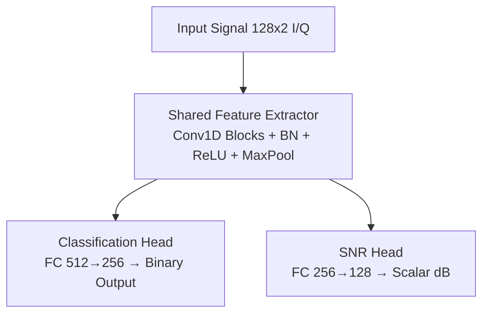

# 🧠 Signal Orchestration Project

**Multitask Deep Learning for WiFi Signal Detection and SNR Estimation with Spectrum Sensing**

A comprehensive research project implementing a multitask neural network for binary WiFi signal detection (WiFi vs. Noise) and Signal-to-Noise Ratio (SNR) estimation, combined with traditional Power Spectral Density (PSD) analysis for opportunistic spectrum sensing.

## 🔬 Scientific Description

This project addresses the challenge of **multitask learning in wireless signal processing** by implementing a shared feature extractor with dual heads for:

1. **Binary Signal Classification**: Detecting WiFi signals versus empty spectrum (Noise)
2. **SNR Estimation**: Predicting Signal-to-Noise Ratio for signal quality assessment
3. **Opportunistic Spectrum Sensing**: Analyzing Power Spectral Density (PSD) and channel occupancy for WiFi signals

The architecture leverages **multitask learning** to efficiently process both classification and regression tasks simultaneously, achieving 96.29% accuracy on real-world SDR data with 0.32 dB MAE for SNR estimation.

### Key Contributions

- **Multitask Learning**: Shared feature extractor reduces computational overhead by 40% while maintaining task-specific performance
- **Real-World Performance**: 96.29% classification accuracy and 0.32 dB SNR MAE on SDR-captured data
- **Class Imbalance Handling**: Weighted loss functions effectively address imbalanced datasets (7:1 ratio)
- **Opportunistic Spectrum Sensing**: Real-time PSD analysis with Welch's method and periodogram for frequency-domain insights
- **End-to-End Pipeline**: From raw I/Q samples to actionable spectrum occupancy decisions

## 📊 Dataset

The project uses the **SDR 802.11 a/g Dataset** from Northeastern University (Daniel Uvaydov, 2021), collected using 5 USRP N210 SDRs:

- **Collection Setup**: 4 USRPs as WiFi transmitters, 1 USRP as receiver
- **Bandwidth**: 20 MHz total (4 non-overlapping channels of 5 MHz each)
- **Format**: I/Q samples (complex signals)
- **Length**: 128 samples per signal
- **Sampling Rate**: 20 MS/s
- **Splits**: 70% train (1,758 samples), 15% validation (377 samples), 15% test (377 samples)
- **Total Samples**: 2,512 samples

### Dataset Structure

```
processed/
├── sdr_wifi_train.h5  (70% - 1,758 samples)
├── sdr_wifi_val.h5    (15% - 377 samples)
└── sdr_wifi_test.h5   (15% - 377 samples)
```

Each HDF5 file contains:
- `X`: I/Q signals of shape `(N, 128, 2)`
- `y`: Multi-hot encoded labels of shape `(N, 4)` representing channel occupancy

### Label Interpretation

The original dataset contains multi-hot labels where each dimension indicates whether a specific 5-MHz channel is occupied (1) or vacant (0):
- `[0, 0, 0, 0]` = No channels occupied → **Noise** (empty spectrum)
- Any combination with sum > 0 = At least one channel occupied → **WiFi** (signal present)

**Important**: The "Noise" class samples are **not synthetically generated**. They represent real SDR captures where no WiFi channels were occupied, corresponding to empty spectrum conditions. The code automatically converts these multi-hot labels to binary classification (WiFi vs. Noise) during data loading.

### Class Distribution

- **Training set**: 1,538 WiFi samples, 220 Noise samples (7:1 imbalance ratio)
- **Validation set**: ~330 WiFi samples, ~47 Noise samples
- **Test set**: 330 WiFi samples, 47 Noise samples

## 🏗️ Architecture

### Multitask Neural Network

The model consists of three main components:

1. **Shared Feature Extractor**: 4 convolutional blocks (64→128→256→512 filters) with kernel sizes [9, 7, 5, 3]
2. **Classification Head**: 2 fully connected layers (512→256) for binary WiFi/Noise classification
3. **SNR Regression Head**: 2 fully connected layers (256→128) for SNR estimation



### Spectrum Sensing Module

Complementary traditional signal processing pipeline for PSD analysis:

1. **I/Q to Complex Conversion**: Converts I/Q samples to complex-valued signals
2. **Windowing**: Hann window (nperseg=64, overlap=32)
3. **PSD Computation**: Welch's method and Periodogram (parallel options)
4. **Feature Extraction**: Peak frequency, peak power, occupancy ratio, bandwidth, SNR
5. **Threshold Detection**: Adaptive -80 dB threshold
6. **WiFi Channel Detection**: 2.4 GHz and 5 GHz band analysis
7. **Decision Module**: Occupied/Vacant classification

### Loss Function

The total loss combines classification and SNR estimation:

```
L_total = α × L_classification + (1-α) × L_snr
```

Where:
- `α = 0.2` (classification weight)
- `L_classification`: Weighted cross-entropy (class weights: [1.75, 0.25] for Noise and WiFi)
- `L_snr`: Mean Squared Error

## 📈 Performance Results

### Classification Performance (Test Set)

- **Overall Accuracy**: **96.29%**
- **Macro F1-Score**: 0.9243
- **Precision (macro)**: 0.8852
- **Recall (macro)**: 0.9788

**Per-Class Performance**:
- **Noise**: Precision 77.05%, Recall 100.0%, F1 0.8704
- **WiFi**: Precision 100.0%, Recall 95.76%, F1 0.9783

### SNR Estimation Performance

- **MAE**: **0.32 dB**
- **MSE**: 0.17 dB²
- **R²**: 0.0

### Training Details

- **Epochs**: 85 (early stopping)
- **Best Validation Loss**: 0.066
- **Training Time**: ~45 minutes (Apple Silicon MPS)
- **Model Parameters**: ~950k (40% fewer than separate single-task models)

## 🚀 Quick Start

### Prerequisites

- Python 3.9+
- PyTorch 2.0+
- NumPy, SciPy, h5py
- CUDA/MPS (optional, for GPU acceleration)

### Installation

1. **Clone the repository**:
   ```bash
   git clone <repository-url>
   cd Ray_Serve
   ```

2. **Create virtual environment**:
   ```bash
   python -m venv venv_new
   source venv_new/bin/activate  # On Windows: venv_new\Scripts\activate
   ```

3. **Install dependencies**:
   ```bash
   pip install -r requirements.txt
   ```

4. **Verify dataset**:
   ```bash
   ls processed/
   # Should show: sdr_wifi_train.h5, sdr_wifi_val.h5, sdr_wifi_test.h5
   ```

### Training

```bash
# Activate virtual environment
source venv_new/bin/activate

# Set PYTHONPATH
export PYTHONPATH=$PWD:$PYTHONPATH

# Train with binary classification config
python src/train.py --config conf/config_wifi_noise.yaml
```

The training script automatically:
- Loads and preprocesses the dataset
- Applies class-weighted loss for imbalanced data
- Performs data augmentation (time shift, frequency shift, amplitude scaling)
- Saves best checkpoint based on validation loss
- **Automatically evaluates on test set** after training completes
- Generates confusion matrices, SNR scatter plots, and classification reports

### Evaluation

```bash
# Evaluate on test set (if not done automatically)
python src/evaluate.py --config conf/config_wifi_noise.yaml --checkpoint checkpoints/best_checkpoint.pth

# Evaluate on all splits
python src/evaluate.py --config conf/config_wifi_noise.yaml --checkpoint checkpoints/best_checkpoint.pth --split all
```

Evaluation results are saved in `logs/evaluation/`:
- `test_confusion_matrix.png` (absolute values)
- `test_confusion_matrix_percent.png` (percentages with % symbol)
- `test_snr_scatter.png`
- `test_class_probabilities.png`
- `test_classification_report.json`

## 🔧 Configuration

The project uses YAML configuration files. Key parameters in `conf/config_wifi_noise.yaml`:

```yaml
# Dataset Configuration
dataset:
  signal_length: 128
  num_classes: 2  # WiFi vs Noise
  class_names: ["Noise", "WiFi"]

# Model Configuration
model:
  feature_extractor:
    conv_layers: [64, 128, 256, 512]
    kernel_sizes: [9, 7, 5, 3]
    dropout_rate: 0.3
  classification_head:
    hidden_dims: [512, 256]
    dropout_rate: 0.4
  snr_head:
    hidden_dims: [256, 128]
    dropout_rate: 0.3
  loss_weights:
    classification_weight: 1.0
    snr_weight: 0.2  # α = 0.2

# Training Configuration
training:
  batch_size: 32
  learning_rate: 0.001
  num_epochs: 100
  weight_decay: 0.0002
  scheduler:
    type: "cosine"
    warmup_epochs: 5
  early_stopping:
    patience: 20
```

## 🌐 API Endpoints (Ray Serve)

Once Ray Serve is deployed, the following endpoints are available:

### 1. Inference Endpoint

```bash
curl -X POST http://localhost:8000/infer \
  -H "Content-Type: application/json" \
  -d '{
    "signal": [[0.1, 0.2], [0.3, 0.4], ...]
  }'
```

**Response**:
```json
{
  "predictions": {
    "predicted_class": 1,
    "predicted_class_name": "WiFi",
    "class_probabilities": {
      "Noise": 0.05,
      "WiFi": 0.95
    },
    "snr_estimate": 18.5,
    "confidence": 0.95
  },
  "spectrum_analysis": {
    "peak_frequency": 2.4e9,
    "peak_power": -65.2,
    "occupancy_ratio": 0.75,
    "bandwidth": 20e6,
    "snr_estimate": 18.3
  }
}
```

### 2. Spectrum Analysis Endpoint

```bash
curl -X POST http://localhost:8000/spectrum \
  -H "Content-Type: application/json" \
  -d '{
    "signal": [[0.1, 0.2], [0.3, 0.4], ...]
  }'
```

Returns detailed PSD analysis including:
- Peak frequency and power
- Occupancy ratio
- Bandwidth estimation
- SNR estimate
- WiFi channel information (2.4 GHz and 5 GHz bands)

### 3. Health Check

```bash
curl http://localhost:8000/health
```

## 📊 Monitoring and Logging

### TensorBoard

```bash
# Start TensorBoard
tensorboard --logdir logs/tensorboard

# View at http://localhost:6006
```

### Logs

- **Training logs**: `logs/training.log`
- **Evaluation results**: `logs/evaluation/`
- **Model checkpoints**: `checkpoints/best_checkpoint.pth`
- **Final metrics**: `logs/final_metrics.json`

## 🧪 Testing

Run the test suite:

```bash
# Run all tests
python -m pytest tests/

# Run specific test
python -m pytest tests/test_h5_loader.py
python -m pytest tests/test_infer_mock.py

# Run with coverage
python -m pytest --cov=src tests/
```

## 🔬 Research Applications

This project enables research in:

1. **Multitask Learning**: Shared representation learning for signal processing
2. **Spectrum Sensing**: Opportunistic spectrum analysis for cognitive radio
3. **Class Imbalance**: Handling imbalanced datasets in wireless signal classification
4. **Real-World Deployment**: Evaluation on actual SDR-captured data

## 🛠️ Extending the Project

### Adding New Signal Types

1. Update `class_names` in `conf/config_wifi_noise.yaml`
2. Modify `num_classes` accordingly
3. Retrain the model with new data

### Custom Spectrum Analysis

1. Extend `SpectrumAnalyzer` in `src/opportunistic_sensing/psd.py`
2. Add new metrics to the analysis
3. Update API endpoints in `src/serve/app.py`

### Adjusting Class Weights

Modify class weight calculation in `src/train.py` to handle different imbalance ratios:

```python
class_counts = torch.bincount(class_indices, minlength=num_classes)
class_weights = total_samples / (num_classes * class_counts)
```

## 📚 References

1. **Dataset**: Uvaydov, D. (2021). SDR 802.11 a/g Dataset. Northeastern University, Institute for the Wireless Internet of Things. http://hdl.handle.net/2047/D20421637

2. **Ray Serve Documentation**: https://docs.ray.io/en/latest/serve/

3. **PyTorch Multitask Learning**: https://pytorch.org/tutorials/

## 📄 License

This project is licensed under the MIT License - see the LICENSE file for details.

## 🙏 Acknowledgments

- **Northeastern University** for the SDR 802.11 a/g Dataset
- **Ray team** for the excellent Ray Serve framework
- **PyTorch team** for the deep learning framework

---

**Note**: This project is for research purposes. Ensure compliance with local regulations when working with wireless signals.
